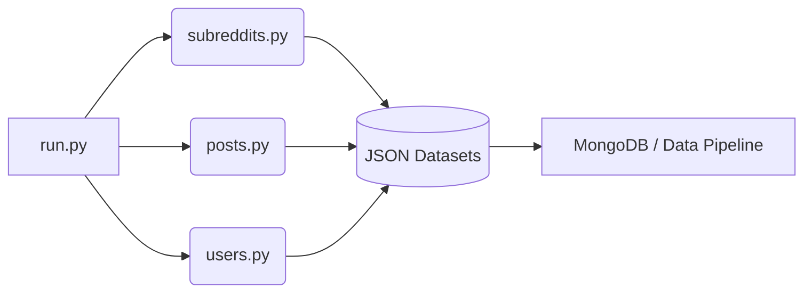

<div align="center">
  

  # 🚀 Reddit Scraper & Data Pipeline

  **A highly modular, asynchronous framework for extracting rich, structured data from Reddit.**  
  *Built for Researchers, Data Scientists, and AI Engineers.*

  [](https://www.python.org/)
  []()
  []()
  []()

</div>

---

## ✨ Why Use This Scraper?

Tired of messy, unformatted web scraping? This pipeline leverages `asyncpraw` to seamlessly navigate Reddit's API, outputting **pristine, hierarchical JSON datasets** ready for immediate use in machine learning pipelines, LLM training, or academic research.

- ⚡ **Asynchronous by Default:** Maximizes I/O efficiency for continuous, high-speed data extraction.
- 🌳 **Hierarchical Comment Trees:** Flawlessly preserves nested replies, keeping conversational context intact.
- 📊 **Rich Metadata:** Captures upvotes, awards, flairs, timestamps, and deep media links (images/videos).
- 🛠️ **Plug-and-Play Architecture:** Easily extendable for custom data transformations or database integrations.

---

## 🏗️ Architecture & Workflow

The framework operates on a modular pipeline, ensuring each component runs independently:



---

## 📦 Quick Start Guide

### 1. Installation

Clone the repository and spin up a virtual environment:

```bash
git clone https://github.com/glowfi/reddit-scraper.git
cd reddit-scraper

# Create and activate virtual environment
python -m venv env
source env/bin/activate      # Linux / macOS
# env\Scripts\activate       # Windows

# Install dependencies
pip install -r requirements.txt
```

### 2. Configuration

Rename `env-sample` to `.env` and configure your API credentials. 

> [!TIP]
> **Need API Keys?** Head over to [Reddit App Preferences](https://www.reddit.com/prefs/apps) to register a "Script" application and generate your Client ID and Secret.

```ini
username=your_reddit_username
password=your_reddit_password
client_id=your_client_id
client_secret=your_client_secret

TOTAL_SUBREDDITS_PER_TOPICS=6
SUBREDDIT_SORT_FILTER=hot
POSTS_PER_SUBREDDIT=10
POSTS_SORT_FILTER=new
```

### 3. Execute Pipeline

Fire up the scraper and watch the data flow!

```bash
python run.py
```

---

## 🗂️ Data Extraction Scope

| 📌 Entity | 📝 Extracted Data Points |
| :--- | :--- |
| **Subreddits** | Subscriber counts, active users, descriptions, creation dates, community rules. |
| **Posts** | Titles, body text, upvote ratios, author flairs, media URLs (video/image), spoiler tags. |
| **Comments** | Full conversational trees, nested replies, scores, awards, author profiles. |
| **Users** | Account age, karma breakdowns, trophy lists, recent activity. |

---

## 🛠️ Advanced Utilities

This repository comes bundled with scripts to manage large-scale data post-extraction:

- `utils/split.py`: Seamlessly partition massive JSON files (16MB+) into manageable chunks.
- `utils/import_data_to_mongodb.sh`: Bulk import your freshly scraped JSON directly into a local MongoDB cluster.

> [!WARNING]
> **Rate Limits:** This scraper respects Reddit's official API limits (100 requests / min). Do not attempt to bypass these delays, or your API access may be permanently revoked.

---

<div align="center">
  <i>Contributions and PRs are always welcome!</i><br>
  <b>License: GPL-3.0</b>
</div>
